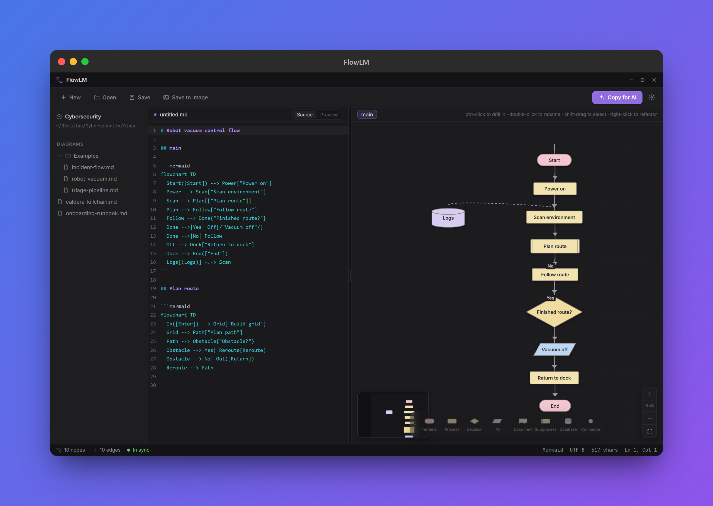
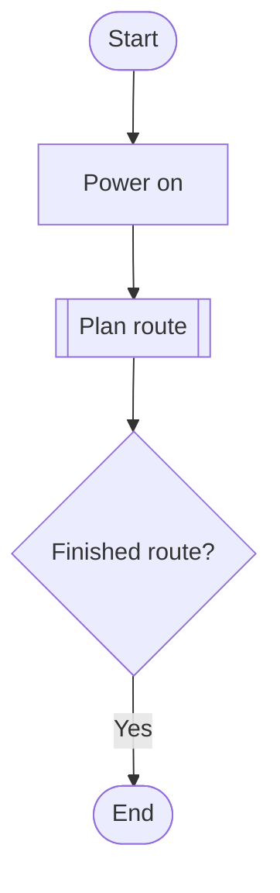

<div align="center">


# FlowLM

**Draw a flowchart, get clean Mermaid text. Paste Mermaid, get a flowchart.**

</div>

FlowLM is a desktop flowchart editor whose source of truth is concise, AI-readable Mermaid kept in sync with the canvas both ways. Draw a system and the tool writes the Mermaid; type or paste Mermaid and the diagram appears. Every diagram is saved as plain Markdown in a folder you control, so your work lives happily in an Obsidian vault, a git repo, or any folder of `.md` files, and a bundled MCP server lets Claude read and edit it directly.

<p align="center">
  
</p>

## Features

- **Two-way sync.** A text pane and a canvas that always agree. Edit either, the other follows.
- **Built for LLMs.** One click copies the whole diagram to your clipboard, ready to drop into Claude or any model for design, review, or extension.
- **Eight first-class shapes.** Terminal, process, decision, I/O, document, subprocess, database, and connector, each with a canonical Mermaid spelling.
- **Drill-down subprocesses.** A subprocess node is a callable sub-diagram. Double-click to descend, breadcrumbs to climb back out. It reads to an LLM like a set of function definitions.
- **One-click refactors.** Extract to subprocess, inline, collapse a linear chain, merge duplicate nodes, and tidy the layout.
- **Automatic layout.** Clean, layered diagrams that respect flow direction, courtesy of ELK.
- **Local-first files.** Open and save `.md`, browse a live file tree, and export to PNG, JPEG, or SVG. No account, no cloud, no telemetry.
- **Bundled MCP server.** Let Claude Code or Claude Desktop list, read, create, and update your diagrams whether or not the app is running.

## Quick start

### Install

Download the latest build from the [Releases page](https://github.com/sect0r-cybersec/FlowLM/releases):

- **Windows:** the NSIS installer (`FlowLM-<version>-setup.exe`) or the portable build.
- **Linux:** the AppImage (`FlowLM-<version>.AppImage`), then `chmod +x` and run it.

Prefer to run from source? See [Contributors and developers](#contributors-and-developers).

On first launch FlowLM creates a vault at `~/Documents/FlowLM` and seeds it with an example diagram.

## Usage

Diagrams are ordinary Markdown: a title, then one or more `## block` sections, each holding a fenced `mermaid` chart. That means you can hand-edit them, version them in git, or open them in Obsidian.

````markdown
# Robot vacuum control flow

## main


````

Three ways to work:

- **Draw it.** Add nodes and edges on the canvas; the Mermaid text updates as you go.
- **Type it.** Paste or write Mermaid in the text pane; the diagram redraws (and keeps the last good version while you are mid-edit).
- **Hand it to an LLM.** Click **Copy for AI** to put the whole document on your clipboard, then ask a model to extend or review it.

## Documentation

- Format and shapes: the on-disk Markdown layout and the eight-shape palette are described inline in [the source](packages/core/src).
- MCP setup: see [Wiring up the MCP server](#wiring-up-the-mcp-server) below.

## Support

Found a bug, want a feature, or have a question? Open an issue at [github.com/sect0r-cybersec/FlowLM/issues](https://github.com/sect0r-cybersec/FlowLM/issues).

## Contributors and developers

Everything below is for building, running, and extending FlowLM locally.

### Prerequisites

- **Node.js 20 or newer** and **npm 9+** (npm ships with Node 20).
- **git** to clone.
- A desktop OS. Packaged builds target Windows and Linux; macOS runs from source.

No database, services, or environment variables are needed to develop or run.

### Clone and install

```bash
git clone https://github.com/sect0r-cybersec/FlowLM.git flowlm
cd flowlm
npm install          # installs every workspace from the repo root
```

Install from the **root**: the workspaces link `@flowlm/core` into the app and the MCP server. Do not `npm install` inside a subpackage.

### Run

```bash
npm run dev:web      # fast browser preview at http://localhost:5199 (no Electron, instant HMR)
npm run dev          # the full desktop app with real file dialogs and a vault on disk
```

The browser preview has no file system, so the sidebar shows a demo vault and file dialogs are inert. Everything else (canvas, text sync, refactors, layout) is live.

### Verify a checkout

```bash
npm run typecheck    # tsc across every workspace
npm run test         # Vitest across every workspace (expect 60 passing)
npm run build        # production build of core, desktop, and mcp
```

### Project layout

FlowLM is an npm-workspaces monorepo built around one pure engine.

| Package | Role |
| ------- | ---- |
| `@flowlm/core` (`packages/core`) | Framework-free diagram engine: model, shapes, serialiser, parser, refactors. The single source of diagram truth. |
| `@flowlm/desktop` (`apps/desktop`) | The Electron app: React renderer, ELK layout, file I/O, image export. |
| `@flowlm/mcp` (`apps/mcp`) | A standalone stdio MCP server that reads and edits a vault, validating every write through `@flowlm/core`. |

Because the app and the MCP server both import `@flowlm/core`, they can never disagree on what a valid diagram is. Rebuild core after editing it; the root `dev`, `build`, `test`, and `typecheck` scripts do this for you.

### Build and package

```bash
npm run build                       # core + desktop bundle + mcp
npm run package -w @flowlm/desktop  # electron-builder installers into apps/desktop/dist
```

Targets: a Windows NSIS installer plus a portable build, and a Linux AppImage. The packaged app is self-contained, so no runtime `node_modules` ship.

### Wiring up the MCP server

Build the server, then register it with Claude Desktop (`claude_desktop_config.json`) or Claude Code:

```bash
npm run build -w @flowlm/core
npm run build -w @flowlm/mcp        # bundles to apps/mcp/dist/index.js
```

```jsonc
{
  "mcpServers": {
    "flowlm": {
      "command": "node",
      "args": ["/absolute/path/to/apps/mcp/dist/index.js"],
      "env": { "FLOWLM_VAULT": "/absolute/path/to/your/vault" }
    }
  }
}
```

It exposes `list_diagrams`, `read_diagram`, `create_diagram`, and `update_diagram`. The vault resolves from a CLI argument, then `FLOWLM_VAULT`, then `~/Documents/FlowLM`. Point it at the same folder the desktop app uses and the two stay in lockstep. The server speaks MCP over stdout; all diagnostics go to stderr.

### Continuous integration

- [`ci.yml`](.github/workflows/ci.yml) runs typecheck, test, and build on every push to `main` and every pull request.
- [`release.yml`](.github/workflows/release.yml) builds Windows and Linux installers and publishes a GitHub Release when you push a `v*` tag (`npm version patch` then `git push --follow-tags`).

### Contributing

Issues and pull requests are welcome. Please run `npm run typecheck` and `npm run test` before opening a PR, and keep new logic covered by tests next to the code as `*.test.ts`.

## Licence

FlowLM is released under the MIT Licence. See [LICENSE](LICENSE).

The one documented allowlist exception is **elkjs** (EPL-2.0); `npm run license-check` enforces a permissive-licence allowlist for all other production dependencies.
