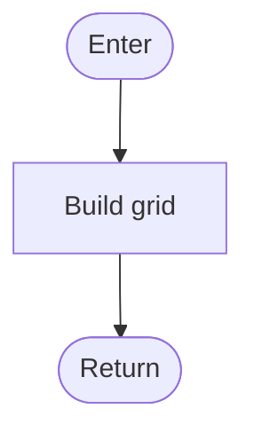

# FlowLM

A **visual-first flowchart desktop app** whose canonical representation is concise,
AI-readable **Mermaid** text kept in sync with the canvas in both directions. Draw a
system on the canvas and the tool writes the Mermaid; type or paste Mermaid and the
diagram appears. Then copy the text into an LLM to design, review, or extend the system.

> "Mermaid in reverse" — you draw, the tool writes the text; type/paste the text and
> the diagram appears.

FlowLM stores every diagram as plain Markdown (a title plus `## block` sections, each a
fenced `mermaid` chart), so your diagrams live happily inside an Obsidian vault, a git
repo, or any folder of `.md` files — and a bundled **MCP server** lets Claude Code /
Claude Desktop read and edit that vault directly.

---

## Table of Contents

- [Key Features](#key-features)
- [Tech Stack](#tech-stack)
- [Prerequisites](#prerequisites)
- [Getting Started](#getting-started)
- [Project Structure](#project-structure)
- [Architecture](#architecture)
  - [The three packages](#the-three-packages)
  - [The document model](#the-document-model)
  - [Bidirectional sync](#bidirectional-sync-canvas--text)
  - [Shape palette](#shape-palette)
  - [Subprocesses & drill-down](#subprocesses--drill-down)
  - [Refactors](#refactors)
  - [Auto-layout (ELK)](#auto-layout-elk)
  - [Electron process model & security](#electron-process-model--security)
- [The MCP Server](#the-mcp-server)
- [Available Scripts](#available-scripts)
- [Testing](#testing)
- [Building & Packaging](#building--packaging)
- [Continuous Integration & Releases](#continuous-integration--releases)
- [Configuration & Data Locations](#configuration--data-locations)
- [Troubleshooting](#troubleshooting)
- [Licensing](#licensing)

---

## Key Features

- **Two-way sync** — a CodeMirror text pane and a React Flow canvas that are always in
  agreement. Edit either; the other follows (debounced, non-destructive).
- **AI-readable source of truth** — diagrams serialize to compact Mermaid inside
  Markdown. One click puts the whole document on your clipboard ("Copy for AI").
- **Eight first-class shapes** — terminal, process, decision, I/O, document, subprocess,
  database, connector — each with a canonical Mermaid spelling.
- **Subprocesses & drill-down** — a `[[Plan route]]` node is a callable sub-diagram;
  double-click to descend, breadcrumbs to climb back out. Reads to an LLM like a set of
  function definitions.
- **Structural refactors** — extract-to-subprocess, inline-subprocess, collapse-linear-chain,
  merge-duplicate-nodes, and tidy-layout, all operating on the pure model.
- **ELK auto-layout** — clean layered layouts that respect flow direction (TD/LR/…).
- **Local-first files** — open/save `.md`, a configurable vault with a live file tree,
  atomic writes, and PNG / JPEG / SVG export.
- **Bundled MCP server** — a standalone stdio server so Claude can list/read/create/update
  diagrams in your vault whether or not the app is running, with every write validated
  through the same parser the app uses.
- **Single dark theme** — violet accent, Inter + JetBrains Mono, frameless custom title bar.

---

## Tech Stack

| Layer            | Choice                                                              |
| ---------------- | ------------------------------------------------------------------ |
| **Language**     | TypeScript 5.6 (strict), ES modules                                |
| **Runtime**      | Node.js ≥ 20                                                        |
| **Desktop shell**| Electron 33 + [electron-vite](https://electron-vite.org) 2         |
| **UI**           | React 18                                                           |
| **Canvas**       | [React Flow](https://reactflow.dev) (`@xyflow/react` v12)          |
| **Text editor**  | CodeMirror 6 (`@uiw/react-codemirror`, Markdown language)          |
| **Mermaid render** | `mermaid` v11 (used for the read-only preview mode)              |
| **Parser**       | `mermaid-ast` (Mermaid → AST → our model)                          |
| **Auto-layout**  | [elkjs](https://github.com/kieler/elkjs) 0.11 (layered algorithm)  |
| **Image export** | `html-to-image`                                                    |
| **MCP**          | `@modelcontextprotocol/sdk` 1.29, `zod` 4 (stdio transport)        |
| **Build/bundle** | Vite 5, esbuild (MCP), `tsc` (core), electron-builder 25           |
| **Tests**        | Vitest 2 (60 tests)                                                |
| **Fonts**        | `@fontsource/inter`, `@fontsource/jetbrains-mono` (bundled, offline)|

Monorepo via npm workspaces (`packages/*`, `apps/*`).

---

## Prerequisites

- **Node.js 20 or newer** (`node --version`). Enforced via the root `engines` field.
- **npm 9+** (ships with Node 20). The repo uses npm workspaces and a committed
  `package-lock.json`; `npm ci` reproduces it exactly.
- **git** — to clone.
- A desktop OS for the full app. The app is built and released for **Windows** (NSIS
  installer + portable) and **Linux** (AppImage). macOS runs from source via `npm run dev`
  but has no packaged target configured.
- No database, no services, no environment variables are required to develop or run.

---

## Getting Started

### 1. Clone and install

```bash
git clone <your-repo-url> flowlm
cd flowlm
npm install          # installs every workspace from the repo root
```

> `npm install` from the **root** is required — workspaces link `@flowlm/core` into the
> app and the MCP server via symlinks. Do not `npm install` inside a subpackage.

### 2. Run the app

The fastest inner loop is the **browser preview** (no Electron, instant HMR):

```bash
npm run dev:web      # builds @flowlm/core, then serves the UI at http://localhost:5199
```

In the browser preview there is no file system, so the sidebar shows a demo vault and the
file dialogs are inert — everything else (canvas, text sync, refactors, layout) is live.

For the **full desktop app** (real file dialogs, vault on disk, window controls):

```bash
npm run dev          # builds @flowlm/core, then launches Electron with HMR
```

On first launch the app creates a vault at `~/Documents/FlowLM` (or the OS equivalent) and
seeds it with a `robot-vacuum.md` example, then opens it.

### 3. Verify your checkout

```bash
npm run typecheck    # tsc across every workspace
npm run test         # vitest across every workspace — expect 60 passing
npm run build        # full production build of core + desktop + mcp
```

If those three pass you have a healthy environment.

---

## Project Structure

```
flowlm/
├── package.json                 # root: workspaces, top-level scripts, license tooling
├── package-lock.json
├── LICENSE                      # MIT
├── .github/workflows/
│   ├── ci.yml                   # typecheck + test + build on push/PR
│   └── release.yml              # tag-triggered installer build + GitHub Release
│
├── packages/
│   └── core/                    # @flowlm/core — pure, framework-free diagram engine
│       ├── src/
│       │   ├── model.ts         # FlowNode / FlowEdge / FlowGraph / FlowDocument types
│       │   ├── shapes.ts        # the 8-shape palette (ShapeKind)
│       │   ├── serialize.ts     # graph  → Mermaid / Markdown
│       │   ├── parse.ts         # Mermaid / Markdown → graph (via mermaid-ast)
│       │   ├── refactor.ts      # extract / inline / collapse / merge
│       │   ├── index.ts         # barrel re-export
│       │   └── *.test.ts        # vitest specs
│       └── package.json         # builds with tsc to dist/
│
├── apps/
│   ├── desktop/                 # @flowlm/desktop — the Electron app
│   │   ├── electron.vite.config.ts   # main/preload/renderer build config
│   │   ├── vite.web.config.ts        # browser-only preview server (port 5199)
│   │   ├── electron-builder.yml      # installer config (win nsis/portable, linux AppImage)
│   │   ├── build/                    # app icons + gen-icons.mjs
│   │   └── src/
│   │       ├── main/            # Electron main process (Node)
│   │       │   ├── index.ts     # window creation, CSP, IPC handlers
│   │       │   ├── files.ts     # vault listing, open/save, export, atomic writes
│   │       │   └── settings.ts  # persisted vault path
│   │       ├── preload/
│   │       │   └── index.ts     # contextBridge → window.flowlm API
│   │       ├── shared/          # code shared between main & renderer (fileTree)
│   │       └── renderer/        # React UI
│   │           └── src/
│   │               ├── App.tsx           # the whole app shell + sync orchestration
│   │               ├── components/        # TitleBar, Toolbar, Sidebar, panes, menus…
│   │               ├── core/layout.ts     # ELK layout engine
│   │               ├── flowAdapter.ts     # model ↔ React Flow node/edge mapping
│   │               ├── exportImage.ts     # PNG/JPEG/SVG export
│   │               └── data/sample.ts     # initial robot-vacuum diagram
│   │
│   └── mcp/                     # @flowlm/mcp — local stdio MCP server
│       ├── src/
│       │   ├── index.ts        # tool registration (list/read/create/update)
│       │   └── vault.ts        # safe vault I/O (validate + atomic + traversal guard)
│       └── esbuild.mjs         # bundles to dist/index.js
```

---

## Architecture

### The three packages

```
@flowlm/core   ── imported by ──▶  @flowlm/desktop   (the app)
      └────────── imported by ──▶  @flowlm/mcp       (the MCP server)
```

`@flowlm/core` is the **single source of diagram truth**. It is pure TypeScript — no React,
no DOM, no Electron — containing the model types, the shape palette, the serializer, the
parser, and the refactors. Because both the desktop app and the MCP server import it, they
can never disagree on what a valid diagram is or how it serializes. Every write path in the
app and in the MCP server runs through `parseDocument` / `serializeDocument` from this one
package.

### The document model

A FlowLM file is a `FlowDocument`: an optional title plus an ordered list of named
`FlowBlock`s. `blocks[0]` is always `main`; every other block is a subprocess whose name
matches a `[[label]]` reference somewhere in the document.

```ts
interface FlowDocument { title?: string; blocks: FlowBlock[] }
interface FlowBlock    { name: string; graph: FlowGraph }
interface FlowGraph    { direction: 'TD'|'TB'|'LR'|'RL'|'BT'; nodes: FlowNode[]; edges: FlowEdge[] }
interface FlowNode     { id: string; kind: ShapeKind; label: string }
interface FlowEdge     { id?: string; source: string; target: string; label?: string; dashed?: boolean }
```

On disk this becomes Obsidian-friendly Markdown:

````markdown
# Robot vacuum control flow

## main


## Plan route


````

A bare document containing just a single fenced `mermaid` block (no `## sections`) is
treated as a one-block `main` document, so hand-written Mermaid drops in cleanly.

### Bidirectional sync (canvas ↔ text)

The orchestration lives in [`App.tsx`](apps/desktop/src/renderer/src/App.tsx). Two effects
keep the panes in agreement, with a guard flag (`applyingProgrammatic`) to prevent feedback
loops:

- **Canvas → text.** When nodes/edges change from user interaction, the active block's
  graph is folded back into the document model, the whole document is re-serialized, and the
  text pane updates. Cached node positions are stored per block.
- **Text → canvas.** Edits to the text pane are debounced (300 ms) and parsed. On success
  the model is replaced and the active block is re-laid-out via ELK; on a parse error the
  status bar shows `error` and the **last good diagram is kept** (your canvas never blanks
  out mid-keystroke). When our own serializer produced the text, the echo is detected and
  the parse is skipped.

The status bar surfaces the sync state (`synced` / `parsing` / `error`) alongside node,
edge, and character counts and the cursor position.

### Shape palette

Eight canonical shapes, each with a fixed Mermaid spelling (see
[`shapes.ts`](packages/core/src/shapes.ts) and [`serialize.ts`](packages/core/src/serialize.ts)):

| Kind         | Canvas shape        | Mermaid syntax                         |
| ------------ | ------------------- | -------------------------------------- |
| `terminal`   | pill / stadium      | `A([Start])`                           |
| `process`    | rectangle           | `B[Power on]`                          |
| `decision`   | diamond             | `C{Battery low?}`                      |
| `io`         | parallelogram       | `D[/Power off/]`                       |
| `document`   | document            | `E@{ shape: doc, label: "…" }` (v11)   |
| `subprocess` | double-bar rectangle| `F[[Plan route]]`                      |
| `database`   | cylinder            | `G[(Logs)]`                            |
| `connector`  | small circle        | `H(( ))`                               |

The serializer handles the sharp edges of Mermaid by hand: reserved-keyword node ids
(`end`, `graph`, …) and ids starting with `o`/`x` are remapped to deterministic `n1`, `n2`
ids; labels are quoted only when needed; embedded `"` becomes the `#quot;` entity; dashed
edges use `-.->`. Parsing maps shapes the other way and **degrades unknown shapes** (hexagon,
trapezoid, …) to `process` rather than failing.

### Subprocesses & drill-down

A `subprocess` node whose label is `Plan route` is a reference to the `## Plan route` block.
Double-clicking it descends into that block (creating an empty one if it does not yet exist);
breadcrumbs at the top of the canvas climb back out. Each level keeps its own cached layout.

### Refactors

All refactors are pure functions over the model (see
[`refactor.ts`](packages/core/src/refactor.ts)), invoked from the canvas context menu:

| Refactor                  | What it does                                                                                  |
| ------------------------- | --------------------------------------------------------------------------------------------- |
| **Extract to subprocess** | Moves the selected nodes into a new block, leaving a `[[Sub]]` node; boundary edges rewired.  |
| **Inline subprocess**     | Splices a block's nodes back into the parent at the `[[…]]` node; drops the block if unused.   |
| **Collapse linear chain** | Joins a selected chain into one `process` node labelled `A → B → C`.                           |
| **Merge duplicate nodes** | Unifies nodes sharing `(kind, label)`, redirecting edges and de-duping.                        |
| **Tidy layout**           | Discards cached positions and re-runs ELK on the active block.                                 |

### Auto-layout (ELK)

Layout uses elkjs's **layered** algorithm via the bundled build (see
[`core/layout.ts`](apps/desktop/src/renderer/src/core/layout.ts)). The bundled build runs on
the main thread deliberately: the Web Worker build creates a Blob worker, which the app's
strict `script-src 'self'` CSP would block. Flow direction maps to ELK direction
(`TD/TB → DOWN`, `LR → RIGHT`, `RL → LEFT`, `BT → UP`), and node sizes are estimated from
each label so edges route cleanly.

### Electron process model & security

- **Main process** ([`main/index.ts`](apps/desktop/src/main/index.ts)) — owns the frameless
  `BrowserWindow`, registers IPC handlers for window controls, vault/file operations, image
  export, and clipboard, and routes external links to the system browser.
- **Preload** ([`preload/index.ts`](apps/desktop/src/preload/index.ts)) — exposes a single
  typed `window.flowlm` API over `contextBridge`. `contextIsolation` is on; the renderer has
  no direct Node access.
- **Renderer** — the React UI. It guards every `window.flowlm` call so the same code runs in
  the Electron app and the file-system-less browser preview.
- **CSP** — the packaged app sets a strict Content-Security-Policy
  (`default-src 'self'; script-src 'self'; …`); the dev build relaxes it only enough for
  Vite HMR.
- **Atomic writes** — all file and export writes go to a temp file and `rename()` into place,
  so a crash mid-write can't corrupt a diagram.

---

## The MCP Server

`@flowlm/mcp` is a standalone local **stdio** MCP server so Claude Code / Claude Desktop can
read and edit a diagram vault whether or not the desktop app is running. Every write is
validated through the shared `@flowlm/core` parser, written atomically, and confined to the
vault (path-traversal guarded; only `.md` files allowed).

### Tools

| Tool             | Description                                                                  |
| ---------------- | ---------------------------------------------------------------------------- |
| `list_diagrams`  | List all `.md` diagrams in the vault (recursive, sorted).                    |
| `read_diagram`   | Read one diagram's Markdown by vault-relative path.                          |
| `create_diagram` | Create a new diagram; validates content and refuses to overwrite.           |
| `update_diagram` | Overwrite an existing diagram; validates content and refuses to create new. |

### Vault location

Resolved in this order: a `--vault`-style CLI argument, the `FLOWLM_VAULT` environment
variable, else `~/Documents/FlowLM` (matching the app's default). Point it at the same folder
the desktop app uses and the two stay in lockstep.

### Build and wire it up

```bash
npm run build                       # builds core + desktop + mcp
# or just the server:
npm run build -w @flowlm/core
npm run build -w @flowlm/mcp        # bundles to apps/mcp/dist/index.js
```

Register it with Claude Desktop (`claude_desktop_config.json`) or Claude Code:

```jsonc
{
  "mcpServers": {
    "flowlm": {
      "command": "node",
      "args": ["/absolute/path/to/apps/mcp/dist/index.js"],
      "env": { "FLOWLM_VAULT": "/absolute/path/to/your/vault" }
    }
  }
}
```

> The server speaks MCP over **stdout** — all diagnostics go to **stderr**. The bin entry
> `flowlm-mcp` is also exposed for `npx`-style invocation.

---

## Available Scripts

Run from the repo root unless noted.

| Command                    | Description                                                                          |
| -------------------------- | ------------------------------------------------------------------------------------ |
| `npm install`              | Install all workspaces and link `@flowlm/core`.                                      |
| `npm run dev`              | Build core, then launch the full Electron app with HMR.                              |
| `npm run dev:web`          | Build core, then serve the browser-only UI preview at `http://localhost:5199`.       |
| `npm run build`            | Production build of core + desktop bundle + mcp.                                     |
| `npm run build:core`       | Build only `@flowlm/core` (the prerequisite for the renderer).                       |
| `npm run typecheck`        | Build core, then `tsc` across every workspace.                                       |
| `npm run test`             | Build core, then run Vitest across every workspace (60 tests).                       |
| `npm run license-check`    | Fail if any production dependency's license is outside the allowlist.               |
| `npm run license-notices`  | Write `THIRD-PARTY-NOTICES.csv` of all production dependency licenses.               |

Workspace-scoped commands (run with `-w <workspace>`):

| Command                                   | Description                                            |
| ----------------------------------------- | ------------------------------------------------------ |
| `npm run package -w @flowlm/desktop`      | `electron-vite build` then `electron-builder` installers. |
| `npm run test:watch -w @flowlm/desktop`   | Vitest in watch mode for the desktop package.          |
| `npm run start -w @flowlm/mcp`            | Run the built MCP server (`node dist/index.js`).       |

---

## Testing

Tests are written with **Vitest** and live next to the code as `*.test.ts`. The root
`npm test` builds `@flowlm/core` first (the other packages import its `dist/`), then runs
every workspace's suite — **60 tests** in total.

```bash
npm run test                          # everything (builds core first)

# A single package:
npm run test -w @flowlm/core
npm run test -w @flowlm/desktop
npm run test -w @flowlm/mcp

# Watch mode while iterating on the app:
npm run test:watch -w @flowlm/desktop

# A single file (from inside the package):
cd packages/core && npx vitest run src/serialize.test.ts
```

Coverage by area:

| Suite                                  | Focus                                                        |
| -------------------------------------- | ----------------------------------------------------------- |
| `core/serialize.test.ts`               | Every shape token, label quoting, id safety, document layout.|
| `core/parse.test.ts`                   | Mermaid → model, typed shapes, section splitting, fallbacks. |
| `core/refactor.test.ts`                | Extract / inline / collapse / merge correctness.            |
| `desktop/core/layout.test.ts`          | ELK layout engine.                                          |
| `desktop/shared/fileTree.test.ts`      | Path-list → tree conversion.                                |
| `mcp/vault.test.ts`                    | Validation, atomic writes, path-traversal refusal.          |

---

## Building & Packaging

### Production build

```bash
npm run build
```

This builds `@flowlm/core` (tsc → `dist/`), the desktop app
(`electron-vite build` → `apps/desktop/out/`), and the MCP server
(esbuild → `apps/mcp/dist/`).

### Desktop installers

```bash
npm run build:core                     # renderer depends on core's dist/
npm run package -w @flowlm/desktop      # electron-vite build + electron-builder
```

Installers are written to `apps/desktop/dist/`. Targets (from
[`electron-builder.yml`](apps/desktop/electron-builder.yml)):

- **Windows** — NSIS installer (`FlowLM-<version>-<arch>-setup.exe`, lets the user choose the
  install directory) and a portable build.
- **Linux** — AppImage (`FlowLM-<version>-<arch>.AppImage`).

The packaged app is fully self-contained: the renderer (including `@flowlm/core` and all UI
deps) is bundled by Vite, and main/preload import only Electron + Node built-ins, so no
runtime `node_modules` ship.

### Regenerating the app icon

The icon master is `apps/desktop/build/icon.svg`. To rasterize it into the PNG + multi-size
ICO that electron-builder consumes:

```bash
cd apps/desktop && npm i -D sharp png-to-ico   # transient dev deps
node build/gen-icons.mjs                        # writes icon.png (1024) and icon.ico
```

---

## Continuous Integration & Releases

### CI ([`.github/workflows/ci.yml`](.github/workflows/ci.yml))

On every push to `main` and every pull request, an Ubuntu runner installs with `npm ci`,
then runs `npm run typecheck`, `npm test`, and `npm run build`. Superseded runs on the same
ref are auto-cancelled.

### Releases ([`.github/workflows/release.yml`](.github/workflows/release.yml))

Pushing a `v*` tag builds installers on Windows and Linux runners in parallel and publishes
them to a GitHub Release:

```bash
npm version patch        # bumps version + creates the tag
git push --follow-tags   # triggers the release workflow
```

Each runner builds core, packages the app with `electron-builder --publish never`, and
uploads its own artifacts (`.exe` on Windows, `.AppImage` on Linux) via
`softprops/action-gh-release`.

---

## Configuration & Data Locations

FlowLM needs no environment variables to run. The few runtime settings live on disk:

| What                   | Where                                                            | Notes                                              |
| ---------------------- | ---------------------------------------------------------------- | -------------------------------------------------- |
| **Vault** (diagrams)   | `~/Documents/FlowLM` by default                                  | Change it via **Settings** in the app.             |
| **App settings**       | `flowlm-settings.json` in Electron's `userData` dir              | Currently just `vaultPath`; corrupt files fall back to defaults. |
| **MCP vault**          | `FLOWLM_VAULT` env var, or CLI arg, or `~/Documents/FlowLM`      | Point at the same folder as the app to share diagrams. |

The `userData` directory is OS-specific (e.g. `%APPDATA%/FlowLM` on Windows,
`~/.config/FlowLM` on Linux, `~/Library/Application Support/FlowLM` on macOS).

---

## Troubleshooting

**`npm run dev` / `dev:web` fails with "Cannot find module '@flowlm/core'".**
Core hasn't been built yet, or you installed inside a subpackage. From the repo root run
`npm install` then `npm run build:core` (the `dev` scripts normally build core first).

**The canvas went blank or the status bar shows `error` while typing.**
The text isn't valid Mermaid yet. FlowLM intentionally keeps the last good diagram on a parse
error — fix the syntax and it re-renders. Common causes: an unbalanced shape delimiter or a
node id that is a reserved word.

**A shape came back as a plain rectangle after a round-trip.**
The parser degrades shapes outside the eight-shape palette (hexagon, trapezoid, …) to
`process`. Use one of the supported shapes if you need it preserved.

**Layout looks cramped or overlapping after a big paste.**
Right-click the canvas → **Tidy layout** to discard cached positions and re-run ELK.

**The MCP server "starts" but Claude sees no output / it looks like it crashed.**
That `FlowLM MCP server ready. Vault: …` line is printed to **stderr** by design — stdout is
reserved for the MCP protocol. If tools fail, check that `FLOWLM_VAULT` points at a real
directory and that you built the server (`npm run build -w @flowlm/mcp`).

**`update_diagram` / `create_diagram` fails with "Invalid diagram".**
The content must be a valid FlowLM document — a Markdown body with at least one fenced
`mermaid` block (and `## sections` if you want multiple blocks). The server validates with the
same parser the app uses before writing anything.

**`npm run license-check` fails.**
A production dependency introduced a license outside the allowlist. Review it; `elkjs`
(EPL-2.0) is the one documented exception and is excluded from the check.

**File dialogs do nothing in the browser preview.**
Expected — `npm run dev:web` has no file system. Use `npm run dev` (Electron) for real
open/save/export.

---

## Licensing

FlowLM is **MIT** licensed — see [LICENSE](LICENSE).

The one documented allowlist exception is **elkjs**, which is **EPL-2.0**. The
`license-check` script enforces an explicit allowlist of permissive licenses for all other
production dependencies; run `npm run license-notices` to regenerate the full third-party
notices file.
